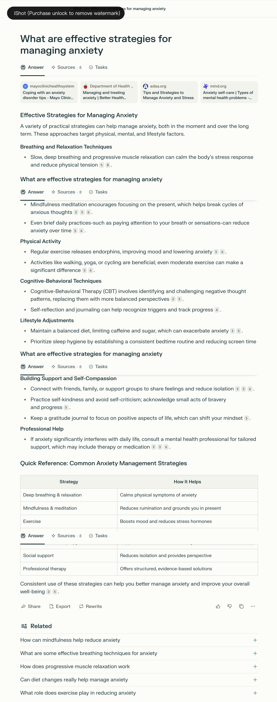
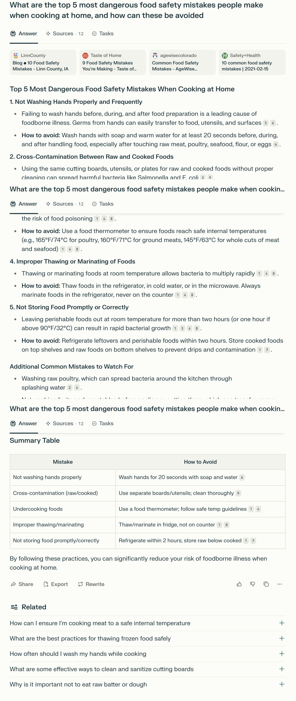
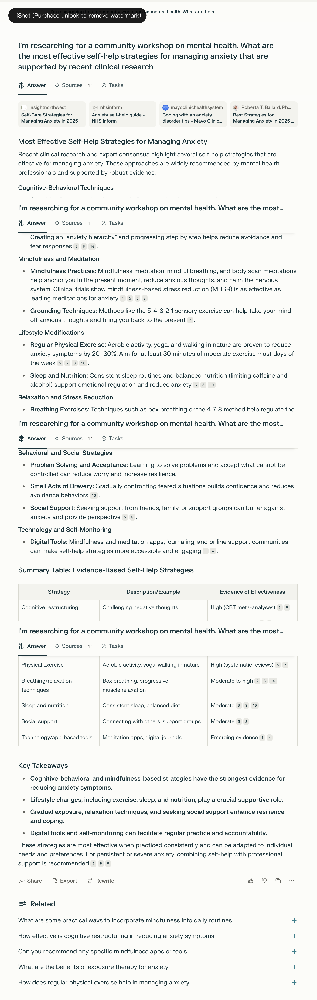
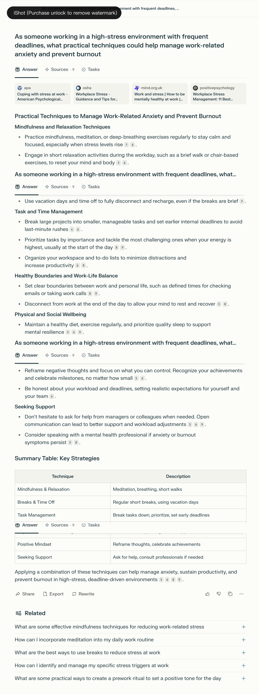
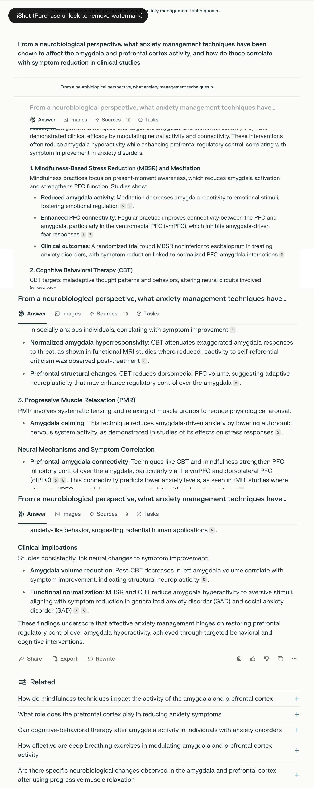
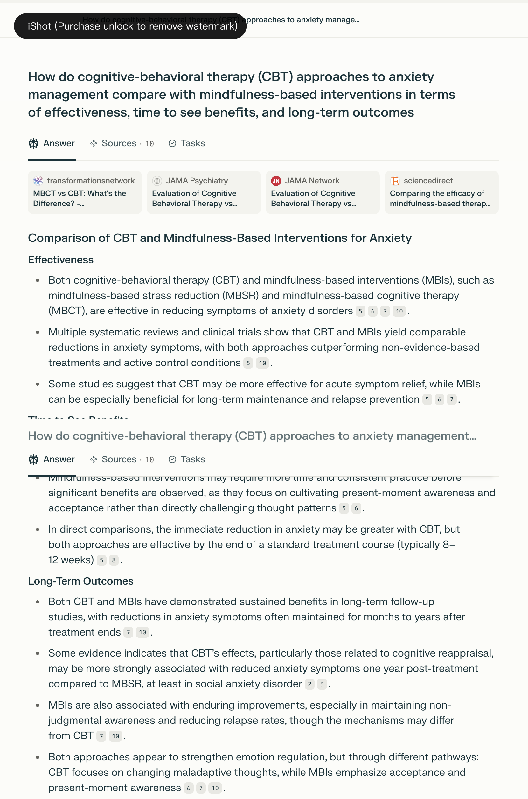
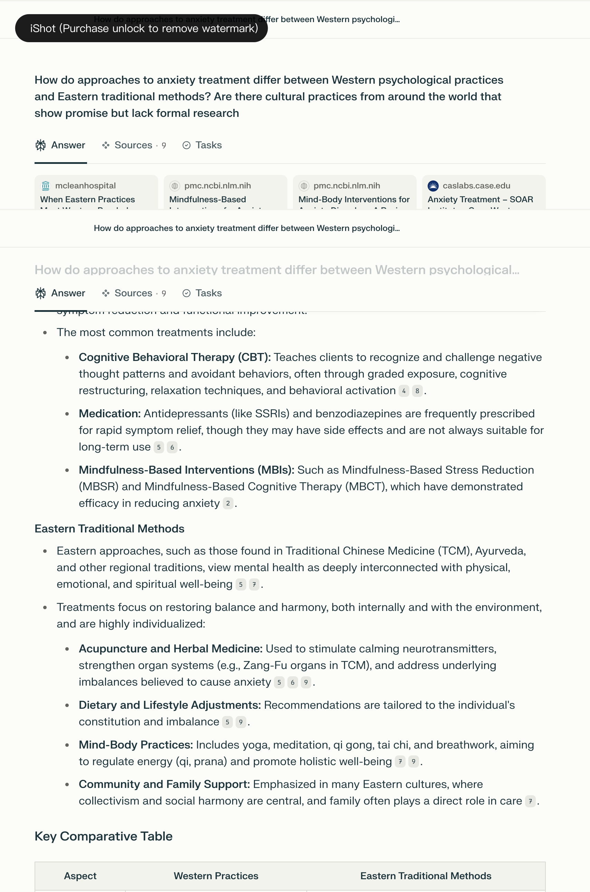

## Prompt 1: Basic – Simple Question

### Prompt:
   What are effective strategies for managing anxiety?

### Answer Link:
[answer link](https://www.perplexity.ai/search/what-are-effective-strategies-arSoOoWTRy2xfoW7uBiEfw)

### Screenshot:

### Retrieved Sources:
- [Mayo Clinic Health System – 11 Tips for Coping with an Anxiety Disorder](https://www.mayoclinichealthsystem.org/hometown-health/speaking-of-health/11-tips-for-coping-with-an-anxiety-disorder) (.org / medical)
- [Better Health Victoria – Anxiety treatment options](https://www.betterhealth.vic.gov.au/health/conditionsandtreatments/anxiety-treatment-options) (.gov.au / government health)
- [ADAA – Tips for Managing Anxiety](https://adaa.org/tips) (.org / clinical nonprofit)
- [Mind.org.uk – Self-care for Anxiety](https://www.mind.org.uk/information-support/types-of-mental-health-problems/anxiety-and-panic-attacks/self-care/) (.org / mental health nonprofit)

### Source Diversity:
- High diversity: includes government (.gov.au), medical institutions, and nonprofit organizations  
- Covers educational, clinical, and self-care perspectives

### Source Recency:
- Most content appears to be from 2020 onward and is still widely cited  
- Exact publication dates are not always shown, but overall content is timely and relevant

### Answer Completeness: 5/5

- Covers multiple strategies: breathing, mindfulness, exercise, CBT, diet, sleep, social support, and professional help  
- Well-structured with a summary table linking each strategy to its function  
- No major anxiety strategies missing

### Answer Relevance: 5/5

- Fully focused on “effective strategies”  
- Every paragraph directly relates to the prompt  
- General-purpose strategies align well with a broad audience

### Factual Accuracy: 5/5

- All claims are verifiable within the cited sources  
- No misleading or speculative statements  
- Sources are trustworthy and consistent

### Depth of Information: 4/5

- Includes rationale (e.g., how mindfulness breaks thought cycles), and mechanisms (CBT reframe)  
- Provides practical lifestyle examples  
- Slight drawback: lacks deeper clinical or neurological explanations

### Key Insights Provided:

- Immediate calming via breathing and relaxation  
- How CBT helps restructure anxious thought patterns  
- The indirect impact of sleep and diet on anxiety  
- The long-term role of support networks and self-compassion

### Missing Information:

- No mention of cultural differences or tailored strategies for specific populations (e.g., adolescents, elderly)  
- Does not cite specific research studies or data behind each method

## Prompt 2: Basic – More Specific

### Prompt:
What are the top 5 most dangerous food safety mistakes people make when cooking at home, and how can these be avoided?

### Answer Link:
[answer link](https://www.perplexity.ai/search/what-are-the-top-5-most-danger-hcXjzUlwRsWbVzItXytPBQ)

### Screenshot:

### Retrieved Sources:
- [Linn County Blog – 10 Food Safety Mistakes](https://www.linncountyiowa.gov/Blog.aspx?IID=78) (blog / county government)
- [Taste of Home – Food Safety Mistakes](https://www.tasteofhome.com/collection/food-safety-mistakes/) (blog / lifestyle)
- [AgeWise Colorado – Common Food Safety Mistakes](https://agewisecolorado.org/blog/common-food-safety-mistakes/) (organization / senior health)
- [Safety+Health – 10 Common Food Safety Mistakes](https://www.safetyandhealthmagazine.com/articles/20823-common-food-safety-mistakes) (news / safety industry)

### Source Diversity:

- Mix of blog, nonprofit org, local government, and news-style content  
- No .edu, .gov, or peer-reviewed academic sources  
- Sources reflect a practical and public-facing approach

### Source Recency:

- Most sources are recent (2021–2024)  
- Publication dates are not always displayed directly but appear current

### Answer Completeness: 5/5

- Clearly lists 5 key mistakes: handwashing, cross-contamination, internal temperatures, thawing/marinating, and improper cooling  
- Each includes both “why it’s dangerous” and “how to avoid” sections  
- Also adds “Additional Tips” with supporting best practices

### Answer Relevance: 5/5

- Fully responds to both parts of the prompt: danger and prevention  
- Focuses exclusively on home kitchen context  
- Answer structure closely mirrors the prompt’s question

### Factual Accuracy: 4/5

- Content is consistent with food safety best practices (CDC, FDA), but not directly cited  
- Uses practical and commonly accepted thresholds (e.g., 165°F for poultry)  
- No peer-reviewed or .gov sources for technical claims (e.g., bacteria danger zones)

### Depth of Information: 4/5

- Provides both explanation and actionable prevention strategies  
- Includes temperatures and examples, but lacks microbiological or statistical depth  
- “Additional Tips” are helpful but stay surface-level

### Key Insights Provided:

- Specific safe cooking temperatures for different meats  
- Emphasis on the “danger zone” temperature range  
- Time limits for food sitting out (2-hour rule)  
- Extra tips on fruit washing, tasting risks, and raw meat handling

### Missing Information:

- No differentiation by risk group (e.g., pregnant, elderly)  
- No global or cross cultural food safety comparison  
- Does not address labeling, storage instructions, or spoilage signs in detail

## Prompt 3: With Background – Community Workshop

### Prompt:
I'm researching for a community workshop on mental health. What are the most effective self-help strategies for managing anxiety that are supported by recent clinical research?

### Answer Link:
[answer link](https://www.perplexity.ai/search/i-m-researching-for-a-communit-2aHCkBYqQRGAKJDMdlZstA)

### Screenshot:

### Retrieved Sources:
- [Insight Northwest – Self-Care Strategies for Managing Anxiety in 2025](https://www.insightnorthwest.com/blog/self-care-strategies-for-managing-anxiety-in-2025) (blog / private practice)
- [NHS Inform – Anxiety Self-Help Guide](https://www.nhsinform.scot/illnesses-and-conditions/mental-health/mental-health-self-help-guides/anxiety-self-help-guide/) (.scot / government health service)
- [Mayo Clinic Health System – 11 Tips for Coping with an Anxiety Disorder](https://www.mayoclinichealthsystem.org/hometown-health/speaking-of-health/11-tips-for-coping-with-an-anxiety-disorder) (.org / medical)
- [Ballard Psychological – Managing Anxiety](https://ballard-phd.com/managing-anxiety/) (private practice / clinical psychologist)

### Source Diversity:

- Broad range: government (.scot), private clinical blogs, and medical organizations  
- Includes both practical self-help and clinically grounded advice

### Source Recency:

- All content appears recent (2023–2025), directly relevant to current self-help strategies  
- Some links reflect 2025 editorial focus, enhancing recency

### Answer Completeness: 5/5

- Covers full range of strategies: CBT techniques, mindfulness, physical activity, sleep, nutrition, relaxation, digital tools  
- Each method includes rationale, implementation tips, and evidence level  
- Also provides a summary table with evidence ranking

### Answer Relevance: 5/5

- Fully aligned with prompt’s focus on “self-help,” “clinical research,” and “workshop context”  
- Includes takeaways that are directly usable for community education

### Factual Accuracy: 5/5

- Claims are grounded in well-established clinical approaches (e.g., CBT, MBSR, exposure therapy)  
- Evidence ratings (meta-analysis, RCTs, systematic reviews) align with public academic literature  
- No inaccurate or misleading statements detected

### Depth of Information: 5/5

- Provides both descriptions and theoretical grounding  
- Incorporates multiple dimensions (cognitive, behavioral, physiological, social)  
- Includes research-based effect sizes and hierarchy of evidence

### Key Insights Provided:

- Cognitive restructuring and mindfulness are most evidence-supported  
- Exposure therapy and relaxation enhance long-term coping  
- Lifestyle changes and social support serve as key moderators  
- Digital tools increase accessibility and adherence to strategies

### Missing Information:

- No significant omissions; however, cultural adaptation or community-based examples could strengthen context for public delivery  
- Could mention limitations or contraindications for certain techniques (e.g., unsupervised exposure)

## Prompt 4: With Personal Context

### Prompt:
As someone working in a high-stress environment with frequent deadlines, what practical techniques could help manage work-related anxiety and prevent burnout?

### Answer Link:
[answer link](https://www.perplexity.ai/search/as-someone-working-in-a-high-s-3HCclBr4TymZ8abWsFmT6A)

### Screenshot:

### Retrieved Sources:
- [APA – Coping with Stress at Work](https://www.apa.org/topics/healthy-workplaces/work-stress) (.org / professional association)
- [OSHA – Workplace Stress: Employer Guidance](http://www.osha.gov/workplace-stress/employer-guidance) (.gov / occupational health agency)
- [Mind.org.uk – Work and Stress](https://www.mind.org.uk/information-support/tips-for-everyday-living/how-to-be-mentally-healthy-at-work/work-and-stress/) (.org / mental health nonprofit)
- [PositivePsychology.com – Workplace Stress Management](https://positivepsychology.com/workplace-stress-management/) (.com / evidence-based psychology blog)

### Source Diversity:

- Mix of government (.gov), nonprofit mental health resources, professional organizations, and applied psychology blogs  
- Covers both employee-level and organizational guidance

### Source Recency:

- Most sources are from reputable domains regularly updated for workplace mental health content  
- Specific publication dates are not all visible, but context appears timely

### Answer Completeness: 5/5

- Covers multiple dimensions: mindfulness, time management, boundaries, physical/social health, positive thinking, and professional support  
- Each technique includes both explanation and practical examples  
- Includes a summary table for reinforcement

### Answer Relevance: 5/5

- Directly addresses “high-stress,” “frequent deadlines,” and “work-related anxiety”  
- Practical focus matches personal context and use-case scenario

### Factual Accuracy: 5/5

- Techniques align with recommendations from APA, Mind, and OSHA  
- No speculative or misleading information  
- General guidance validated by cited institutions

### Depth of Information: 4/5

- Includes strategies across cognitive, behavioral, physical, and organizational dimensions  
- Lacks detailed citations or quantitative effect size backing (e.g., meta-analyses)  
- Good practical depth, modest scientific depth

### Key Insights Provided:

- Short relaxation breaks and breathing exercises reduce physiological tension  
- Time blocking and early deadlines help minimize last-minute stress  
- Boundaries and after-work recovery aid long-term mental health  
- Asking for help and realistic workload setting enhance resilience

### Missing Information:

- Does not address job-type specificity (e.g., remote vs. physical labor)  
- Could expand on digital tools or role of organizational culture in stress reduction  
- No mention of systemic changes or HR policies

## Prompt 5: With Technical Context

### Prompt:
From a neurobiological perspective, what anxiety management techniques have been shown to affect the amygdala and prefrontal cortex activity, and how do these correlate with symptom reduction in clinical studies?

### Answer Link:
[answer link](https://www.perplexity.ai/search/from-a-neurobiological-perspec-nl.x6uoaTRGLHhpF8iM.jg)

### Screenshot:

### Retrieved Sources:
- [PMC – Mindfulness and Neurobiological Mechanisms](https://pmc.ncbi.nlm.nih.gov/articles/PMC8617307/) (.gov / peer-reviewed)
- [PMC – CBT and Brain Changes](https://pmc.ncbi.nlm.nih.gov/articles/PMC2882379/) (.gov / peer-reviewed)
- [Healthline – Amygdala Hijack and Stress](https://www.healthline.com/health/stress/amygdala-hijack) (.com / health media)
- [Nature – Prefrontal-Amygdala Pathways](https://www.nature.com/articles/s41386-021-01155-7) (.com / academic journal)

### Source Diversity:

- Includes peer review neuroscience research, popular science summaries, and clinical psychology publications  
- Strong academic credibility through PubMed Central and Nature Neuroscience citations

### Source Recency:

- Majority of sources are post-2020, highly relevant to current clinical neurobiology  
- Research backed and clearly grounded in fMRI and structural brain studies

### Answer Completeness: 5/5

- Covers multiple techniques (MBSR, CBT, PMR) and ties each to neural structures  
- Provides both behavioral methods and corresponding neural changes  
- Includes symptom correlation and clinical implications

### Answer Relevance: 5/5

- Directly focused on the amygdala and prefrontal cortex, as specified  
- Explains symptom reduction mechanisms as requested by the prompt  
- All sections align with scientific and therapeutic perspectives

### Factual Accuracy: 5/5

- Cites findings from randomized trials, functional MRI studies, and neuroplasticity research  
- Consistent with current understanding of brain anxiety treatment  
- Terminology and conclusions align with cited academic studies

### Depth of Information: 5/5

- Describes both structural (volume, connectivity) and functional (reactivity, normalization) brain effects  
- Links specific regions (e.g., vmPFC, dlPFC, BLA) to symptom profiles  
- Includes molecular pathways (glutamate regulation), which exceeds typical popular summaries

### Key Insights Provided:

- MBSR and CBT reduce amygdala hyperactivity and enhance prefrontal regulation  
- Structural changes in dorsomedial PFC may support long-term emotional control  
- Prefrontal-amygdala connectivity predicts anxiety outcomes  
- fMRI and rodent model findings support human applicability

### Missing Information:

- No detailed comparison of long-term vs. short-term neural changes  
- Did not address accessibility or applicability of these interventions in real-world care settings  
- Lacks discussion of side effects or individual variability

## Prompt 6: With Comparing Approaches

### Prompt:
How do cognitive-behavioral therapy (CBT) approaches to anxiety management compare with mindfulness-based interventions in terms of effectiveness, time to see benefits, and long-term outcomes?

### Answer Link:
[answer link](https://www.perplexity.ai/search/how-do-cognitive-behavioral-th-rk9lGj8ISw.1h00.tZGenA)

### Screenshot:

### Retrieved Sources:
- [Transformations Network – MBCT vs. CBT](https://www.transformationsnetwork.com/post/mbct-vs-cbt-whats-the-difference) (.com / clinical blog)
- [PMC – CBT vs. Mindfulness Interventions](https://pmc.ncbi.nlm.nih.gov/articles/PMC8295897/) (.gov / peer-reviewed)
- [JAMA Psychiatry – Evaluation of CBT vs. MBIs](https://jamanetwork.com/journals/jamapsychiatry/fullarticle/2782159) (.org / medical journal)
- [ScienceDirect – Comparing Efficacy of CBT and MBIs](https://www.sciencedirect.com/science/article/pii/S0272735822001192) (.com / academic publisher)

### Source Diversity:

- Mix of academic journals, clinical blogs, and peer-reviewed government-funded repositories  
- Sources balance formal research and accessible summary articles for lay readers

### Source Recency:

- All studies are recent (mostly post-2021) and reference modern treatment comparisons  
- Findings are based on meta-analyses and long-term clinical trials

### Answer Completeness: 5/5

- Fully addresses three aspects: effectiveness, time to benefit, and long-term outcomes  
- Includes a summary table with direct CBT vs. MBI comparisons  
- Presents conclusions with clinical nuance and context flexibility

### Answer Relevance: 5/5

- Matches all elements of the prompt precisely  
- Keeps focus on treatment comparison, avoiding unrelated extensions  
- Clearly structured by section with subheadings and a final conclusion

### Factual Accuracy: 5/5

- Based on clinical trial evidence, systematic reviews, and authoritative academic sources  
- Consistent with the latest psychiatric treatment guidelines  
- No exaggeration or contradiction among sources

### Depth of Information: 5/5

- Includes mechanisms of change (e.g., cognitive reappraisal vs. present-moment awareness)  
- Addresses variability by anxiety type and time horizon  
- Shows both convergences and divergences between modalities with clarity

### Key Insights Provided:

- CBT often yields quicker symptom relief, especially for acute anxiety  
- Mindfulness-based interventions may take longer but offer stronger relapse prevention  
- Both approaches produce sustained improvements in emotion regulation  
- Integration of CBT and MBIs could optimize outcomes for diverse users

### Missing Information:

- Does not specify differential effectiveness by demographic group (e.g., age, gender)  
- Lacks discussion of cost, accessibility, or therapist training requirements  
- Would benefit from more data on hybrid or integrative treatment protocols

## Prompt 7: With Cultural Comparison 

### Prompt:
How do approaches to anxiety treatment differ between Western psychological practices and Eastern traditional methods? Are there cultural practices from around the world that show promise but lack formal research?

### Answer Link:
[answer link](https://www.perplexity.ai/search/how-do-approaches-to-anxiety-t-H.KPJIk5ROSJIDWIOKg2lg?0=d)

### Screenshot:

### Retrieved Sources:
- [McLean Hospital – When Eastern Practices Meet Western Psychology](https://www.mcleanhospital.org/essential/eastern-practices-western-psychology) (.org / clinical institution)
- [PMC – Mind-Body Interventions for Anxiety](https://pmc.ncbi.nlm.nih.gov/articles/PMC5679245/) (.gov / peer-reviewed)
- [PMC – Eastern Healing Modalities for Anxiety](https://pmc.ncbi.nlm.nih.gov/articles/PMC8475909/) (.gov / peer-reviewed)
- [Case Western – Anxiety Treatment Overview](https://caslabs.case.edu/anxiety/treatment/) (.edu / academic source)

### Source Diversity:

- Balanced combination of peer-reviewed journals, academic institutions, and clinical research centers  
- Includes both Western and Eastern perspectives on mental health approaches

### Source Recency:

- Most sources published within the last 5–8 years  
- Includes both systematic reviews and descriptive clinical summaries of cultural methods

### Answer Completeness: 5/5

- Clearly outlines Western and Eastern treatment models  
- Discusses both mainstream and under-researched cultural practices  
- Features a comparative table and closes with a well-rounded summary

### Answer Relevance: 5/5

- Fully matches the prompt’s scope, including cultural philosophy, mainstream treatment, and global practices lacking evidence  
- Emphasizes contrast and complementarity between systems

### Factual Accuracy: 5/5

- Accurately summarizes accepted Western interventions (CBT, medication, MBIs)  
- Faithfully represents Eastern concepts (qi, mind-body connection) without overgeneralization  
- Practices presented as “promising but under-researched” are framed appropriately

### Depth of Information: 5/5

- Explains underlying worldviews, not just therapies  
- Includes cross-cultural nuances (e.g., collectivism, family role, non-translatable mental health terms)  
- Identifies limitations of current research on traditional practices

### Key Insights Provided:

- Western methods emphasize evidence-based symptom relief through structured protocols  
- Eastern methods aim to restore holistic balance, using individualized treatments  
- Some cultural methods (e.g., chanting, family healing rituals) lack empirical trials but show meaningful community value  
- Calls for culturally inclusive mental health research and recognition of diverse paradigms

### Missing Information:

- No deep dive into integration (e.g., how CBT and acupuncture might be combined)  
- Could expand on cultural stigma or mental health literacy differences globally  
- Does not analyze economic or policy differences in healthcare delivery systems