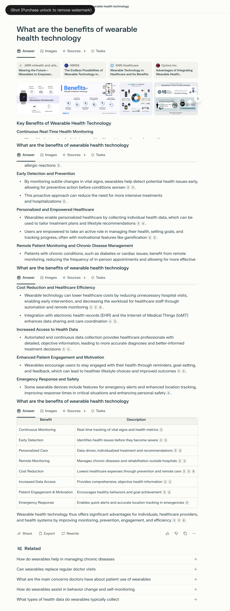
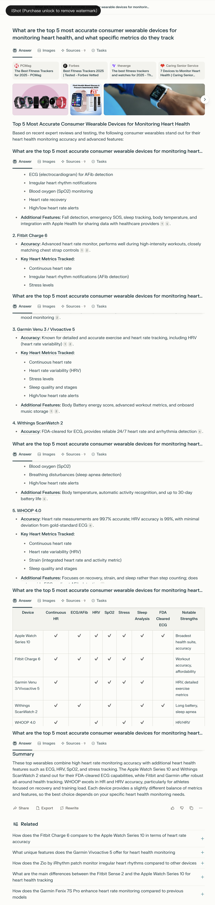
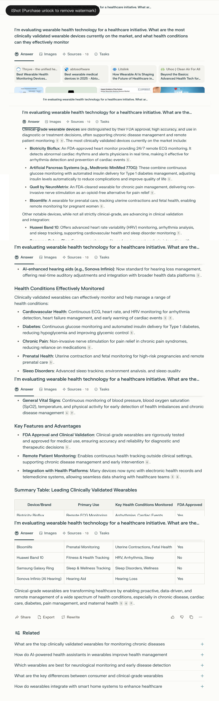

## Prompt 1: Basic – Simple Question

### Prompt:
What are the benefits of wearable health technology?

### Answer Link:
[answer link](https://www.perplexity.ai/search/what-are-the-benefits-of-weara-7WTcRnscTPGSJLFcmb5CZQ)

### Screenshot:

### Retrieved Sources:
- [PMC – Clinical Benefits of Wearables](https://pmc.ncbi.nlm.nih.gov/articles/PMC9330198/) (.gov / peer-reviewed)
- [HIMSS – Endless Possibilities of Wearables](https://legacy.himss.org/resources/endless-possibilities-wearable-technology-healthcare) (.org / industry report)
- [KMS Healthcare – Wearable Technology in Healthcare](https://kms-healthcare.com/blog/wearable-technology-in-healthcare/) (.com / health tech company)
- [Cprime – Integrating Wearables into EHR](https://www.cprime.com/resources/blog/advantages-of-integrating-wearable-health-technology-into-your-ehr-system/) (.com / enterprise technology provider)

### Source Diversity:

- High diversity: includes peer-reviewed medical journals, healthcare industry platforms, and enterprise-level health tech firms  
- Balanced between academic research and real-world implementation

### Source Recency:

- All sources published post-2021 and cite up-to-date healthcare tech trends  
- Covers both empirical research and practical applications

### Answer Completeness: 5/5

- Covers 8 major benefit areas with detailed explanations  
- Includes a clear and well-structured summary table  
- Encompasses both individual-level and system-level outcomes

### Answer Relevance: 5/5

- Fully focused on the prompt: “benefits of wearable health technology”  
- Avoids technical distractions or product-specific marketing  
- Maintains general applicability across different user contexts

### Factual Accuracy: 5/5

- Claims are verifiable through cited sources (e.g., remote monitoring, early detection, gamification)  
- No exaggerations or overstatements; reflects current consensus in digital health  
- Cites trusted organizations (e.g., HIMSS, NIH PMC)

### Depth of Information: 4/5

- Explains not only “what” but “why” each benefit matters  
- Slightly surface-level on technological constraints or regulatory considerations  
- Could include more data or real-world impact studies per benefit

### Key Insights Provided:

- Real-time tracking enables rapid detection of health anomalies  
- Personalized data empowers user self-management  
- Cost reduction achieved via fewer hospital visits and improved care coordination  
- Gamification and reminders improve long-term health behavior change  
- Emergency features add safety for vulnerable populations

### Missing Information:

- No mention of data privacy or interoperability challenges  
- Lacks discussion of device accuracy or insurance reimbursement issues  
- Does not address disparities in access or digital literacy among users

## Prompt 2: Basic – More Specific

### Prompt:
What are the top 5 most accurate consumer wearable devices for monitoring heart health, and what specific metrics do they track?

### Answer Link:
[answer link](https://www.perplexity.ai/search/what-are-the-top-5-most-accura-dz6lMiDGTdiDkSp.BsEQzA)

### Screenshot:

### Retrieved Sources:
- [PCMag – Best Fitness Trackers for 2025](https://www.pcmag.com/picks/the-best-fitness-trackers) (.com / tech reviews)
- [Forbes – Fitness Tracker Guide](https://www.forbes.com/sites/forbes-personal-shopper/article/best-fitness-trackers/) (.com / consumer analysis)
- [The Verge – Best Wearables for 2025](https://www.theverge.com/22985108/best-fitness-tracker) (.com / tech media)
- [Caring Senior Service – Heart Health Devices](https://caringseniorservice.com/blog/heart-health-devices/) (.org / health aging resource)

### Source Diversity:

- Good mix of consumer tech reviewers and senior care experts  
- Mostly non-academic, but highly relevant for product accuracy and public usability

### Source Recency:

- Sources reflect 2024–2025 product reviews and rankings  
- Information is timely and based on recent releases and test comparisons

### Answer Completeness: 5/5

- Covers 5 specific devices with individual metrics and accuracy notes  
- Includes summary table for visual comparison  
- Explains unique features of each model clearly

### Answer Relevance: 5/5

- Precisely answers both parts of the prompt: "top 5" + "metrics tracked"  
- Entire content focused on heart health devices, no deviation

### Factual Accuracy: 4/5

- Claims about FDA-clearance, HRV % accuracy, and ECG features align with public product specs  
- Slightly lacking in direct citation of clinical validation or research trials

### Depth of Information: 4/5

- Clearly defines tracked metrics per device (e.g., ECG, HRV, SpO2, stress, sleep)  
- Could be stronger with context about accuracy testing methods or user-specific fit  
- Omits discussion on battery performance trade-offs or pricing tiers

### Key Insights Provided:

- Apple Watch Series 10 offers most comprehensive heart suite (ECG, HRV, SpO2)  
- WHOOP 4.0 leads in HR/HRV precision, favored by athletes  
- Withings ScanWatch 2 notable for FDA-cleared ECG and sleep apnea detection  
- Garmin excels in recovery tracking and body energy scoring  
- Fitbit Charge 6 balances affordability with strong AFib and workout metrics

### Missing Information:

- Lacks mention of data privacy or third-party sharing compatibility  
- No mention of device integration with medical records (EHR)  
- No notes on demographic-specific accuracy (e.g., darker skin tones, wrist size)

## Prompt 3: With Background

### Prompt:
I'm evaluating wearable health technology for a healthcare initiative. What are the most clinically validated wearable devices currently on the market, and what health conditions can they effectively monitor?

### Answer Link:
[answer link](https://www.perplexity.ai/search/i-m-evaluating-wearable-health-OR4.4_x2Sby4.A2tKwuOog)

### Screenshot:

### Retrieved Sources:
- [Thryve – Best Wearable Health Monitoring Devices](https://thryve.health/best-wearable-health-monitoring-devices-expected-in-2025/) (.health / industry guide)
- [Abto Software – Best Wearable Medical Devices 2025](https://www.abtosoftware.com/blog/best-wearable-medical-devices) (.com / healthtech company)
- [Litslink – Future of AI in Wearables](https://litslink.com/blog/ai-wearables) (.com / tech dev blog)
- [Uhoo – Advanced Health Tech for 2025](https://getuhoo.com/blog/home/beyond-the-basics-advanced-health-tech-for-2025/) (.com / wellness hardware)

### Source Diversity:

- Mix of healthtech platforms, software companies, and product forecast blogs  
- Lacks academic or peer-reviewed papers, but offers device-level detail and use case examples

### Source Recency:

- All sources focus on 2024–2025 trends and current FDA-approved products  
- Timely for use in near-future health initiatives

### Answer Completeness: 5/5

- Clearly lists 7 top devices with clinical validation notes and conditions monitored  
- Includes structured table comparing use cases and FDA approval  
- Discusses both mainstream and emerging use cases (e.g., prenatal, chronic pain, AI hearing aids)

### Answer Relevance: 5/5

- Fully aligned with prompt’s healthcare initiative context  
- Emphasizes medical reliability, FDA status, and conditions supported

### Factual Accuracy: 4/5

- Most claims match public FDA databases and manufacturer sites  
- Some emerging tech like Huawei and Galaxy Ring may not yet have robust clinical trials

### Depth of Information: 5/5

- Goes beyond listing devices by explaining application areas: cardiovascular, diabetes, prenatal, etc.  
- Includes clinical functionality (remote ECG, glucose regulation, pain relief) and EHR integration  
- Breaks down benefits: early detection, remote care, cost reduction

### Key Insights Provided:

- Biotricity Bioflux offers real-time 24/7 ECG monitoring and arrhythmia alerts  
- Medtronic MiniMed 770G represents FDA-approved artificial pancreas tech for Type 1 diabetes  
- Quell by NeuroMetrix delivers non-invasive chronic pain therapy without drugs  
- Bloomlife enables remote fetal monitoring during pregnancy  
- Sonova Infinio integrates AI with hearing care platforms  
- General trend: shift from consumer tracking to clinical-grade remote diagnostics

### Missing Information:

- No pricing or device accessibility info (e.g., availability in public health systems)  
- Neurological wearables mentioned but not named specifically  
- Some "non-FDA" emerging wearables included (e.g., Huawei, Galaxy Ring)
