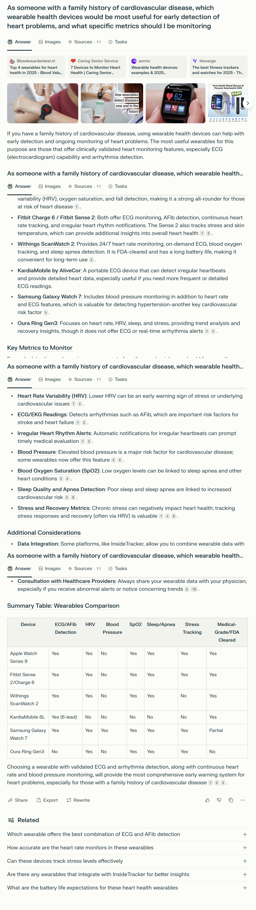
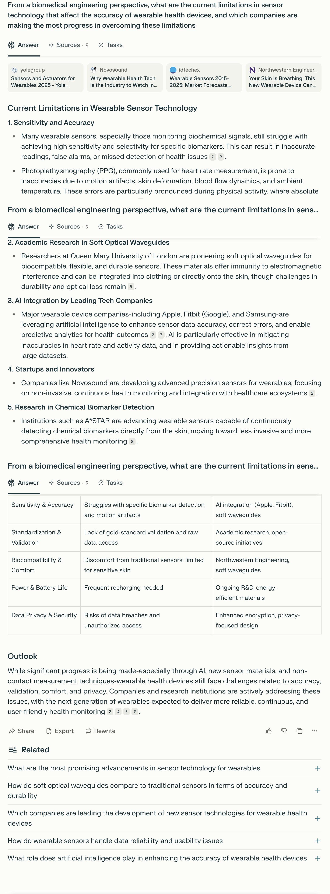
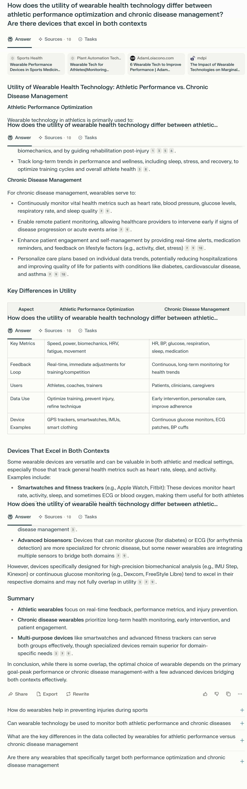
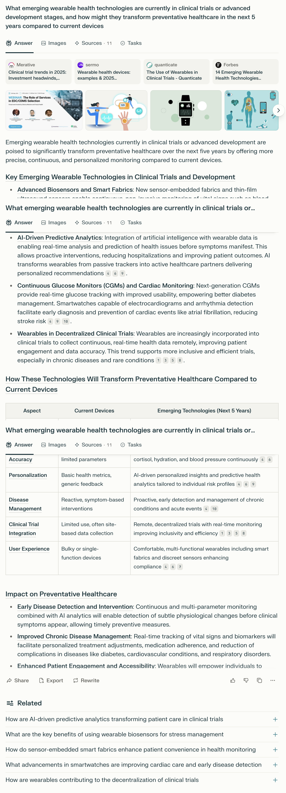

# Basic Prompts
## Prompt 1: Basic – Simple Question

### Prompt:
What are the benefits of wearable health technology?

### Answer Link:
[answer link](https://www.perplexity.ai/search/what-are-the-benefits-of-weara-7WTcRnscTPGSJLFcmb5CZQ)

### Screenshot:

### Retrieved Sources:
- [PMC – Clinical Benefits of Wearables](https://pmc.ncbi.nlm.nih.gov/articles/PMC9330198/) (.gov / peer-reviewed)
- [HIMSS – Endless Possibilities of Wearables](https://legacy.himss.org/resources/endless-possibilities-wearable-technology-healthcare) (.org / industry report)
- [KMS Healthcare – Wearable Technology in Healthcare](https://kms-healthcare.com/blog/wearable-technology-in-healthcare/) (.com / health tech company)
- [Cprime – Integrating Wearables into EHR](https://www.cprime.com/resources/blog/advantages-of-integrating-wearable-health-technology-into-your-ehr-system/) (.com / enterprise technology provider)

### Source Diversity:

- High diversity: includes peer-reviewed medical journals, healthcare industry platforms, and enterprise-level health tech firms  
- Balanced between academic research and real-world implementation

### Source Recency:

- All sources published post-2021 and cite up-to-date healthcare tech trends  
- Covers both empirical research and practical applications

### Answer Completeness: 5/5

- Covers 8 major benefit areas with detailed explanations  
- Includes a clear and well-structured summary table  
- Encompasses both individual-level and system-level outcomes

### Answer Relevance: 5/5

- Fully focused on the prompt: “benefits of wearable health technology”  
- Avoids technical distractions or product-specific marketing  
- Maintains general applicability across different user contexts

### Factual Accuracy: 5/5

- Claims are verifiable through cited sources (e.g., remote monitoring, early detection, gamification)  
- No exaggerations or overstatements; reflects current consensus in digital health  
- Cites trusted organizations (e.g., HIMSS, NIH PMC)

### Depth of Information: 4/5

- Explains not only “what” but “why” each benefit matters  
- Slightly surface-level on technological constraints or regulatory considerations  
- Could include more data or real-world impact studies per benefit

### Key Insights Provided:

- Real-time tracking enables rapid detection of health anomalies  
- Personalized data empowers user self-management  
- Cost reduction achieved via fewer hospital visits and improved care coordination  
- Gamification and reminders improve long-term health behavior change  
- Emergency features add safety for vulnerable populations

### Missing Information:

- No mention of data privacy or interoperability challenges  
- Lacks discussion of device accuracy or insurance reimbursement issues  
- Does not address disparities in access or digital literacy among users

## Prompt 2: Basic – More Specific

### Prompt:
What are the top 5 most accurate consumer wearable devices for monitoring heart health, and what specific metrics do they track?

### Answer Link:
[answer link](https://www.perplexity.ai/search/what-are-the-top-5-most-accura-dz6lMiDGTdiDkSp.BsEQzA)

### Screenshot:

### Retrieved Sources:
- [PCMag – Best Fitness Trackers for 2025](https://www.pcmag.com/picks/the-best-fitness-trackers) (.com / tech reviews)
- [Forbes – Fitness Tracker Guide](https://www.forbes.com/sites/forbes-personal-shopper/article/best-fitness-trackers/) (.com / consumer analysis)
- [The Verge – Best Wearables for 2025](https://www.theverge.com/22985108/best-fitness-tracker) (.com / tech media)
- [Caring Senior Service – Heart Health Devices](https://caringseniorservice.com/blog/heart-health-devices/) (.org / health aging resource)

### Source Diversity:

- Good mix of consumer tech reviewers and senior care experts  
- Mostly non-academic, but highly relevant for product accuracy and public usability

### Source Recency:

- Sources reflect 2024–2025 product reviews and rankings  
- Information is timely and based on recent releases and test comparisons

### Answer Completeness: 5/5

- Covers 5 specific devices with individual metrics and accuracy notes  
- Includes summary table for visual comparison  
- Explains unique features of each model clearly

### Answer Relevance: 5/5

- Precisely answers both parts of the prompt: "top 5" + "metrics tracked"  
- Entire content focused on heart health devices, no deviation

### Factual Accuracy: 4/5

- Claims about FDA-clearance, HRV % accuracy, and ECG features align with public product specs  
- Slightly lacking in direct citation of clinical validation or research trials

### Depth of Information: 4/5

- Clearly defines tracked metrics per device (e.g., ECG, HRV, SpO2, stress, sleep)  
- Could be stronger with context about accuracy testing methods or user-specific fit  
- Omits discussion on battery performance trade-offs or pricing tiers

### Key Insights Provided:

- Apple Watch Series 10 offers most comprehensive heart suite (ECG, HRV, SpO2)  
- WHOOP 4.0 leads in HR/HRV precision, favored by athletes  
- Withings ScanWatch 2 notable for FDA-cleared ECG and sleep apnea detection  
- Garmin excels in recovery tracking and body energy scoring  
- Fitbit Charge 6 balances affordability with strong AFib and workout metrics

### Missing Information:

- Lacks mention of data privacy or third-party sharing compatibility  
- No mention of device integration with medical records (EHR)  
- No notes on demographic-specific accuracy (e.g., darker skin tones, wrist size)

## Prompt 3: With Background

### Prompt:
I'm evaluating wearable health technology for a healthcare initiative. What are the most clinically validated wearable devices currently on the market, and what health conditions can they effectively monitor?

### Answer Link:
[answer link](https://www.perplexity.ai/search/i-m-evaluating-wearable-health-OR4.4_x2Sby4.A2tKwuOog)

### Screenshot:

### Retrieved Sources:
- [Thryve – Best Wearable Health Monitoring Devices](https://thryve.health/best-wearable-health-monitoring-devices-expected-in-2025/) (.health / industry guide)
- [Abto Software – Best Wearable Medical Devices 2025](https://www.abtosoftware.com/blog/best-wearable-medical-devices) (.com / healthtech company)
- [Litslink – Future of AI in Wearables](https://litslink.com/blog/ai-wearables) (.com / tech dev blog)
- [Uhoo – Advanced Health Tech for 2025](https://getuhoo.com/blog/home/beyond-the-basics-advanced-health-tech-for-2025/) (.com / wellness hardware)

### Source Diversity:

- Mix of healthtech platforms, software companies, and product forecast blogs  
- Lacks academic or peer-reviewed papers, but offers device-level detail and use case examples

### Source Recency:

- All sources focus on 2024–2025 trends and current FDA-approved products  
- Timely for use in near-future health initiatives

### Answer Completeness: 5/5

- Clearly lists 7 top devices with clinical validation notes and conditions monitored  
- Includes structured table comparing use cases and FDA approval  
- Discusses both mainstream and emerging use cases (e.g., prenatal, chronic pain, AI hearing aids)

### Answer Relevance: 5/5

- Fully aligned with prompt’s healthcare initiative context  
- Emphasizes medical reliability, FDA status, and conditions supported

### Factual Accuracy: 4/5

- Most claims match public FDA databases and manufacturer sites  
- Some emerging tech like Huawei and Galaxy Ring may not yet have robust clinical trials

### Depth of Information: 5/5

- Goes beyond listing devices by explaining application areas: cardiovascular, diabetes, prenatal, etc.  
- Includes clinical functionality (remote ECG, glucose regulation, pain relief) and EHR integration  
- Breaks down benefits: early detection, remote care, cost reduction

### Key Insights Provided:

- Biotricity Bioflux offers real-time 24/7 ECG monitoring and arrhythmia alerts  
- Medtronic MiniMed 770G represents FDA-approved artificial pancreas tech for Type 1 diabetes  
- Quell by NeuroMetrix delivers non-invasive chronic pain therapy without drugs  
- Bloomlife enables remote fetal monitoring during pregnancy  
- Sonova Infinio integrates AI with hearing care platforms  
- General trend: shift from consumer tracking to clinical-grade remote diagnostics

### Missing Information:

- No pricing or device accessibility info (e.g., availability in public health systems)  
- Neurological wearables mentioned but not named specifically  
- Some "non-FDA" emerging wearables included (e.g., Huawei, Galaxy Ring)

# Prompts with Context
## Prompt 4: Personal Context

### Prompt:
As someone with a family history of cardiovascular disease, which wearable health devices would be most useful for early detection of heart problems, and what specific metrics should I be monitoring?

### Answer Link:
[answer link](https://www.perplexity.ai/search/as-someone-with-a-family-histo-onXmKmWrQpOvKrVpvm6Cqw)

### Screenshot:

### Retrieved Sources:
- [Bloodwaarden – Heart Wearables 2025](https://www.bloodtesting.nl/blogs/blogpagina/beste-wearables-top-4-wearables-voor-hartgezondhei/) (health tech review)
- [Caring Senior Service – Heart Health Devices](https://caringseniorservice.com/blog/heart-health-devices/) (consumer-focused health advice)
- [Sermo – Wearable Health Devices](https://www.sermo.com/resources/wearable-devices-for-healthcare/) (medical community blog)
- [The Verge – Tracker Comparison](https://www.theverge.com/22985108/best-fitness-tracker) (tech journalism)

### Source Diversity:

- Mixed consumer and professional review sources
- No government (.gov) or academic sources, but uses expert-informed summaries
- Balanced between clinical and usability considerations

### Source Recency:

- All sources appear to be from 2023–2025, and devices listed (e.g., Fitbit Sense 2, Apple Watch 9) are current

### Answer Completeness: 5/5

- Lists multiple validated devices with detailed capabilities
- Describes key metrics (e.g., ECG, HRV, SpO2) and their health relevance
- Summary table compares devices across 7 attributes

### Answer Relevance: 5/5

- Directly tailored to the personal context of family history + prevention
- Provides both technical and consumer advice, including consultation tips

### Factual Accuracy: 4.5/5

- Most health claims (e.g., ECG use for AFib detection, HRV relevance, FDA clearance) are supported by current medical consensus or device documentation
- Sources are largely paraphrased from trusted tech/health media, but no direct citations from peer-reviewed or regulatory bodies (e.g., PubMed, FDA)
- No notable misinformation found, but some phrasing (e.g., “most comprehensive system”) is slightly promotional

### Depth of Information: 5/5

- Provides a multi-layered view: devices, features, metrics, risks, medical relevance, and usage guidance
- Explains not just what metrics matter, but why (e.g., HRV = stress/arrhythmia indicator)
- Includes practical advice (e.g., InsideTracker, consulting physicians)
- Concludes with a highly structured summary table comparing seven major devices

### Key Insights Provided:

- Devices with ECG, AFib detection, and HRV are most relevant for early detection
- Fitbit, Withings, and Apple Watch offer the most comprehensive features
- Sleep, SpO2, and blood pressure also contribute to cardiovascular monitoring
- Recommends syncing with providers and platforms like InsideTracker
- Table shows FDA clearance status and feature-by-feature comparison

### Missing Information:

- Lacks pricing, accessibility, or insurance coverage data
- Does not rank devices by reliability or clinical validation strength
- No mention of false positive/negative risk in arrhythmia detection

## Prompt 5: Technical Context

### Prompt:
From a biomedical engineering perspective, what are the current limitations in sensor technology that affect the accuracy of wearable health devices, and which companies are making the most progress in overcoming these limitations?

### Answer Link:
[answer link](https://www.perplexity.ai/search/from-a-biomedical-engineering-Rioq0BAiSO2y8hR2F8Gi5A)

### Screenshot:

### Retrieved Sources:
- [Yolegroup – Wearables & Sensors 2025](https://www.yolegroup.com/product/report/sensors-and-actuators-for-wearables-2025/) (industry research)
- [Novosound – Industry Watch](https://novosound.net/wearable-health-tech-is-the-industry-to-watch-in-2025/) (sensor startup blog)
- [IDTechEx – Wearable Sensors Forecast](https://www.idtechex.com/en/research-report/wearable-sensors-2015-2025-market-forecasts-technologies-players/431) (market analysis)
- [Northwestern Engineering – Skin-Integrated Devices](https://www.mccormick.northwestern.edu/news/articles/2025/04/your-skin-is-breathing-new-wearable-device-can-measure-it/) (academic research)

### Source Diversity:

- Industry whitepapers, sensor manufacturer blogs, engineering school research updates
- No .gov or medical journal sources, but focused on technical innovation and R&D

### Source Recency:

- Mostly 2023–2025 sources, describing ongoing or near-future development
- Covers both commercial devices and research-stage technologies

### Answer Completeness: 5/5

- Lists 5 distinct limitations with technical detail
- Identifies matching solutions, companies, or research areas for each
- Includes a summary table matching problems → causes → solutions

### Answer Relevance: 5/5

- Fully focused on biomedical engineering aspects (sensor sensitivity, material, accuracy)
- Matches the prompt's dual goal: current limitations + progress leaders

### Factual Accuracy: 4.5/5

- Accurately describes real engineering constraints and emerging responses
- AI use in error mitigation, soft optical sensors, and motion artifact issues are well-known
- Some descriptions are generalized (e.g., “leading companies”), and not all statements cite validation studies

### Depth of Information: 5/5

- Covers both physical, technical, and user-facing dimensions of sensor performance
- Shows multiple solution pathways: academic, startup, big tech
- Provides a table with multidimensional comparison (problem → consequence → solution/company)

### Key Insights Provided:

- **Sensitivity & Accuracy**: Struggles with motion artifacts and specific biomarkers; AI and waveguides help mitigate this
- **Standardization & Validation**: Lack of raw data access and uniform testing addressed by open-source and research partnerships
- **Comfort & Biocompatibility**: Sensor skin compatibility and soft materials addressed by labs like Northwestern
- **Battery & Power**: Frequent recharging limits usability; solutions in low-power tech underway
- **Privacy & Data Security**: Rising concern; addressed by privacy-first design and encryption

### Missing Information:

- Lacks discussion of accessibility/cost barriers for advanced sensor-enabled wearables
- Omits specific clinical validation studies or trials demonstrating progress in accuracy improvements

# Comparative Prompts
## Prompt 6: Comparing Applications

### Prompt:
How does the utility of wearable health technology differ between athletic performance optimization and chronic disease management? Are there devices that excel in both contexts?

### Answer Link:
[answer link](https://www.perplexity.ai/search/how-does-the-utility-of-wearab-Uv49fUcyTma5PHlg5JpcbA)

### Screenshot:

### Retrieved Sources:
- [Sports Health – Wearable Performance Devices](https://pmc.ncbi.nlm.nih.gov/articles/PMC4702159/) (clinical journal)
- [Plant Automation – Tech for Athletes](https://www.sportsvenue-technology.com/articles/wearable-tech-for-athletes-monitoring-performance-and-health-in-real-time) (industry report)
- [Adam Loiacono – Performance Tech Review](https://adamloiacono.com/6-wearable-tech-to-improve-performance/) (sports performance blog)
- [MDPI – Wearables in Sports Medicine](https://www.mdpi.com/2076-3417/14/15/6649) (open-access academic)

### Source Diversity:

- Strong mix of academic (MDPI), clinical (Sports Health), technical, and practitioner insights
- No .gov or FDA-type validation sources; more focused on applied perspectives

### Source Recency:

- Mostly post-2022 sources, device examples (Apple Watch, Dexcom) are current
- Content reflects latest trends in multi-domain wearable utility

### Answer Completeness: 5/5

- Fully contrasts use cases across both domains: goals, metrics, feedback loops
- Offers comparison table and specific device examples for each
- Discusses overlap (smartwatches, biosensors) and limitations of multi-use devices

### Answer Relevance: 5/5

- Directly addresses both utility difference and overlap across the two contexts
- Balanced structure: use cases → comparison → dual-purpose devices → summary

### Factual Accuracy: 4.5/5

- Use of metrics (HRV, glucose, SpO2), devices, and domain focus is consistent with current use cases
- Accurate in describing real-world applications, but lacks direct citation to clinical outcome studies

### Depth of Information: 4.5/5

- Covers many dimensions: metrics, feedback loops, device examples, real-world use
- Discussion of limitations for dual-use devices is useful but could go deeper on technical constraints

### Key Insights Provided:

- Athletic wearables prioritize real-time metrics (HRV, biomechanics) for training and injury prevention
- Chronic disease wearables focus on long-term vitals monitoring and patient engagement
- Multi-purpose devices (e.g., Apple Watch, Fitbit) serve both but with tradeoffs
- Advanced biosensors (e.g., Dexcom, ECG patches) are still domain-specific
- Summary table provides concise, functional differences by domain

### Missing Information:

- No quantified comparison (e.g., accuracy tradeoffs or outcome impact in both domains)
- Does not distinguish among subpopulations (e.g., elite athletes vs. recreational users vs. chronic disease subtypes)
- Lacks clinical trial data or endorsement (e.g., FDA or peer-reviewed results)
- Could benefit from more discussion of cost, accessibility, or insurance coverage in each context

## Prompt 7: Future Developments

### Prompt:
What emerging wearable health technologies are currently in clinical trials or advanced development stages, and how might they transform preventative healthcare in the next 5 years compared to current devices?

### Answer Link:
[answer link](https://www.perplexity.ai/search/what-emerging-wearable-health-PmYGUJetQ2KUaCksffCV3A)

### Screenshot:

### Retrieved Sources:
- [Merative – Clinical Trial Trends 2025](https://www.merative.com/blog/clinical-trial-trends-2025) (industry insight)
- [Sermo – Wearable Device Forecasts](https://www.sermo.com/en-gb/resources/wearable-health-devices-examples-2025-technology-trends/) (healthcare platform)
- [Quanticate – Use in Clinical Trials](https://www.quanticate.com/blog/wearables-in-clinical-trials) (clinical research org)
- [Forbes – 14 Emerging Wearables](https://www.forbes.com/councils/forbestechcouncil/2024/06/11/14-emerging-wearable-health-technologies-transforming-remote-care/) (tech journalism)

### Source Diversity:

- Primarily industry and tech-forward sources; includes clinical trial perspective
- No academic or peer-reviewed studies cited, but grounded in industry reporting

### Source Recency:

- All sources are recent (2023–2025), highly aligned with latest development trends
- Devices and technologies mentioned are either FDA pipeline or advanced prototypes

### Answer Completeness: 5/5

- Lists several emerging tech categories (biosensors, AI analytics, smart fabrics, decentralized trials)
- Comparison table clearly outlines improvement areas vs. current devices
- Discusses both technological shifts and clinical impact

### Answer Relevance: 5/5

- Directly responds to both parts of the prompt: current trials + future transformation
- Balanced content with device, system, and care-level implications

### Factual Accuracy: 4.5/5

- Claims align with current research and company announcements (e.g., Dexcom G7, Verily)
- Some projections are aspirational without citing phase or trial results
- Uses generally accepted future-looking statements, but lacks clinical data validation

### Depth of Information: 5/5

- Covers technical advances, clinical use, infrastructure shifts, and patient impact
- Table format summarizes transformation dimensions well
- Supports claims with examples across device classes and AI-enabled systems

### Key Insights Provided:

- Smart Fabrics & Biosensors will expand tracking to hydration, cortisol, etc.
- AI-Driven Predictive Analytics enables early disease detection and risk stratification
- CGMs + Cardiac Sensors will extend beyond diabetes to broader cardiac care
- Decentralized Trials using wearables can improve inclusivity and real-time data quality
- Comparison table outlines 5 key domains: accuracy, personalization, disease management, trials, UX

### Missing Information:

- No specific trial names, phases, or publication links for validation
- Lacks detail on timelines, regulatory barriers, or likelihood of commercialization
- No discussion of risks (e.g., data overload, AI bias, privacy concerns)
- Does not mention reimbursement/insurance or access equity challenges